

<h1>InstantID-Rome</h1>

Supreme [**InstantID**](https://github.com/InstantID/InstantID). Indulge your slight fantasy about Identity-Preserving Generation. 

When in Rome, do as the Romans do.

# Characteristic

* 💃  [Better Body Composition](#better-body-composition).

* 🎨  [More Comfortable Facial Saturation](#more-comfortable-facial-saturation).

* ✏️  [Stronger Editability](#stronger-editability).

* 📐  [More Stable Layout](#more-stable-layout).

* 🇺🇳  [Higher Consistency](#higher-consistency).

* 📷  [More Realistic](#more-realistic).

* 🤔  [Larger Range of Image Scale](#larger-range-of-image-scale)

Unless otherwise specified, the base model is [YamerMIX-V8](https://civitai.com/models/84040?modelVersionId=196039).

## Better Body Composition
Face key points is Not necessary in InstantID-Rome. InstantID-Rome can fully comply with the body composition of raw T2I.

|  | Face   Landmark | Style |
|:-----:|:-----:|:-----:|
InstantID | 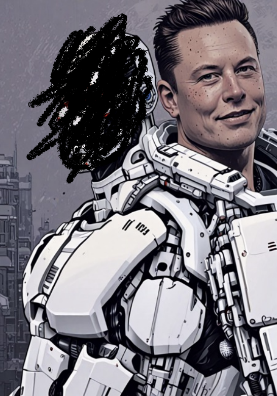 | 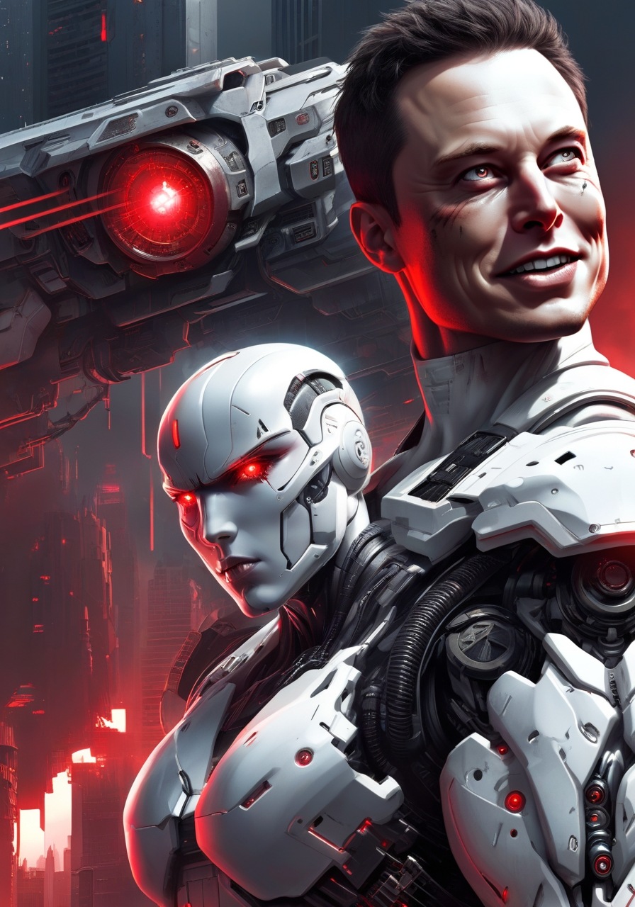  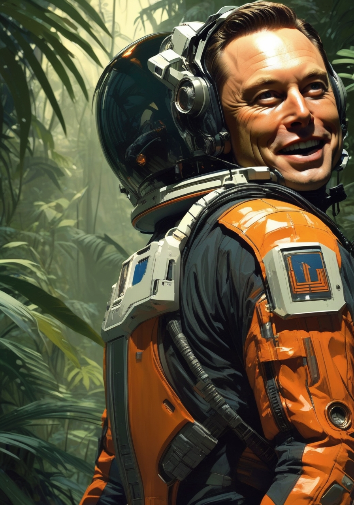    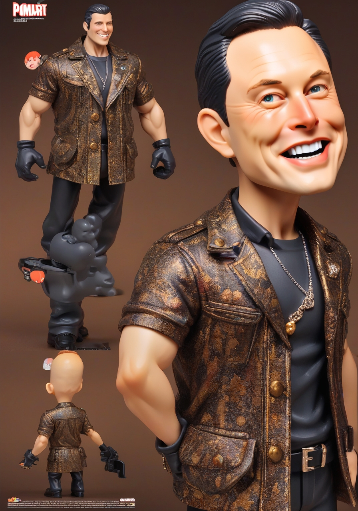 |
InstantID-    Rome | self-   adaptive | 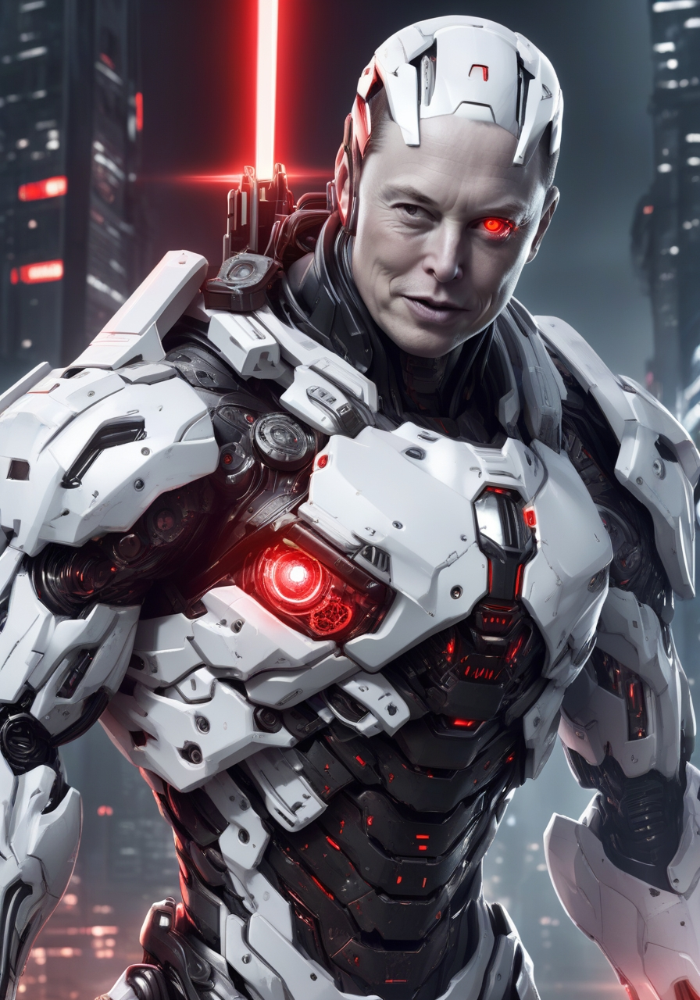  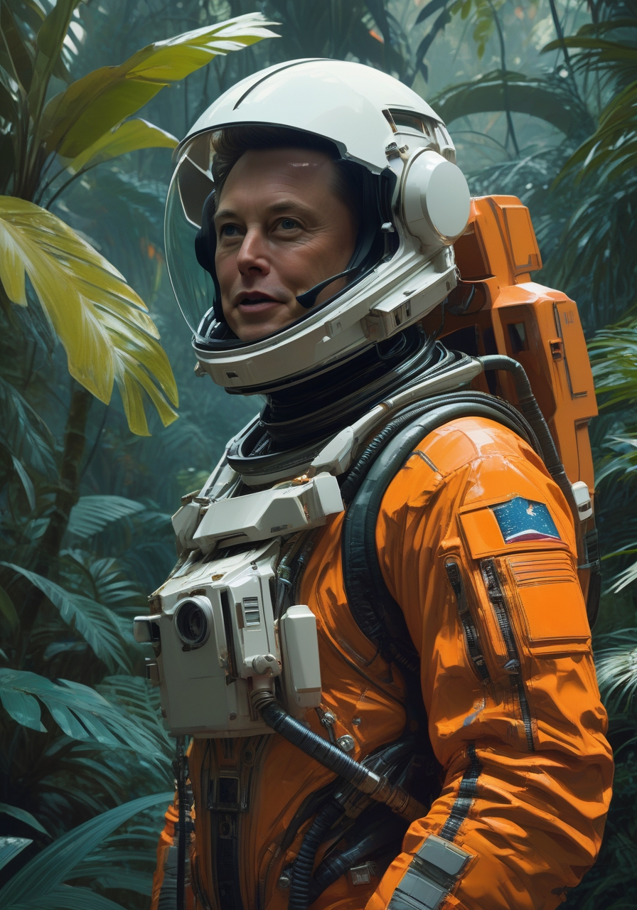    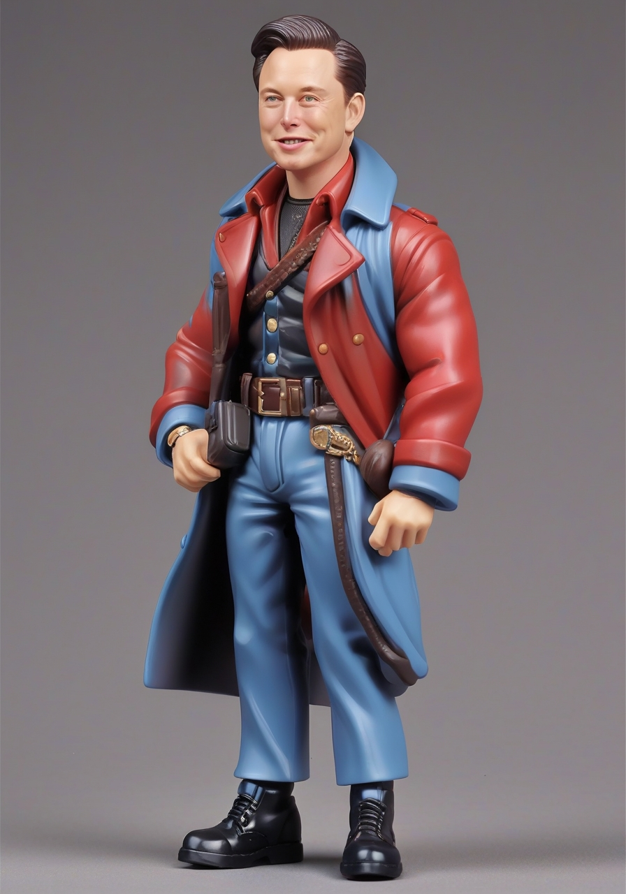 |

## More Comfortable Facial Saturation
InstantID sometimes increases the saturation of the facial image to an uncomfortable level. This issue is particularly noticeable in the realistic style.  InstantID-Rome has significantly resolved this issue. 

|  | self-   adaptive | Style |
|:-----:|:-----:|:-----:|
InstantID | ❌ |   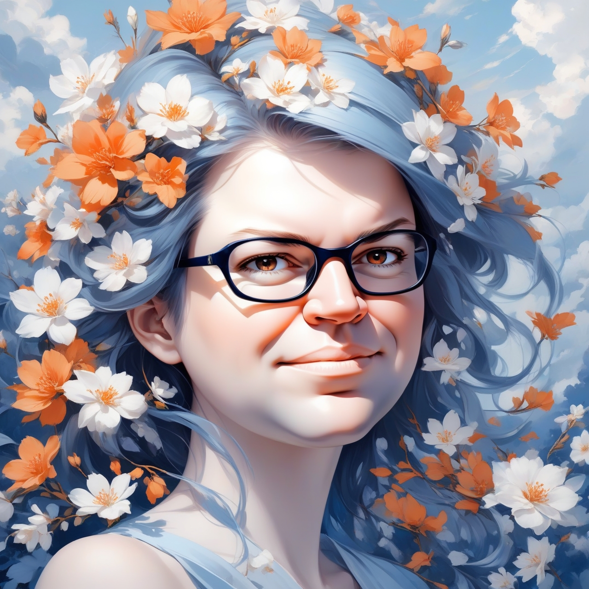 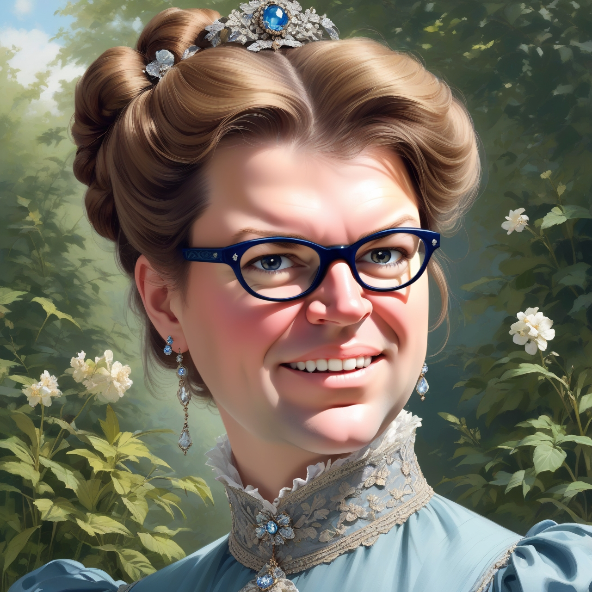 |
InstantID-    Rome | ✅ |   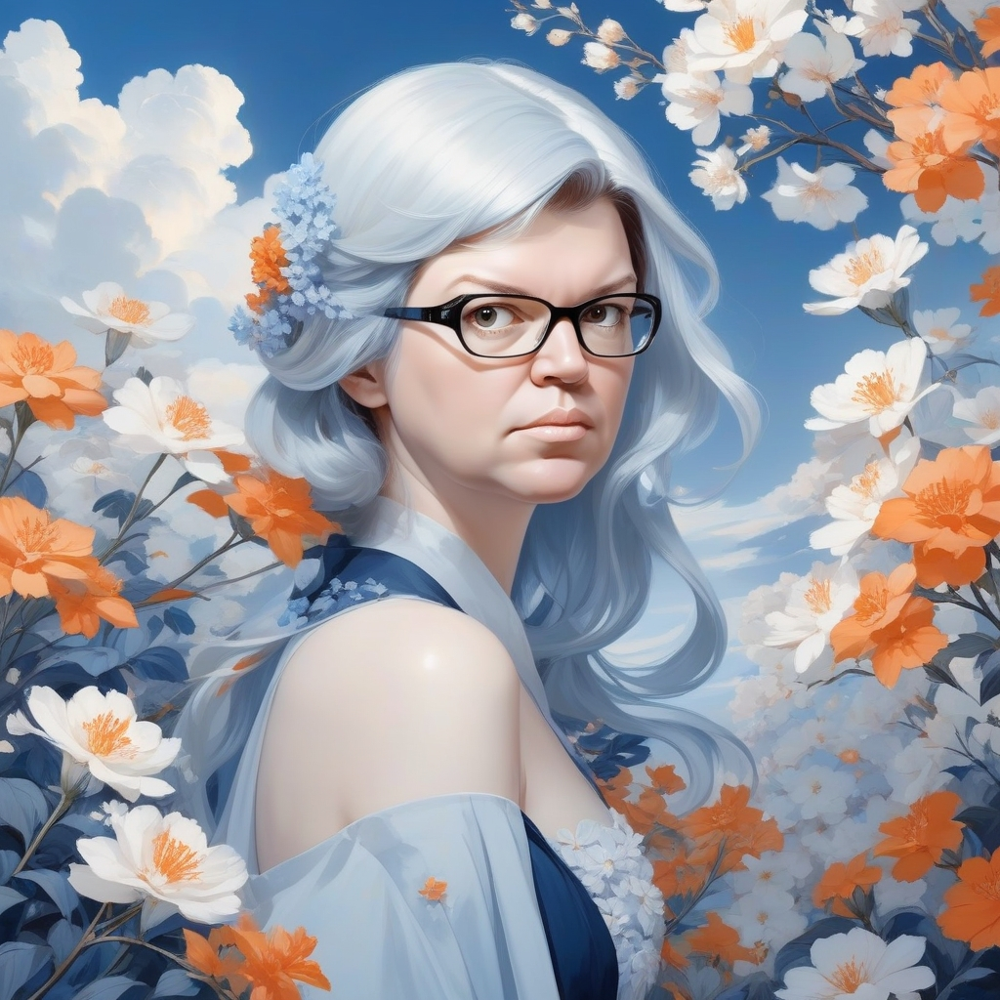  |

## Stronger Editability
While InstantID is unable to achieve this, InstantID-Rome is capable of doing so.
| ID | 'sunglasses' | 'girl' | 'young' | 'old' | 
|:-------------------------:|:-------------------------:|:-------------------------:|:-------------------------:|:-------------------------:|
 |  |  |  | 

| 'a prince wearing headphones and a red and glod armor, reading a book and sitting on bench in front of Eiffel Tower'  |
|:-------------------------:|
   

## More Stable Layout
While InstantID is unable to achieve this, InstantID-Rome is capable of doing so.
|| Style |
|:-------------------------:|:-------------------------:|
T2I w/o ID |      |
 |       |

## Higher Consistency
While InstantID is unable to achieve this, InstantID-Rome is capable of doing so.
| sunglasses | cap |
|:-------------------------:|:-------------------------:|
 | 
| **mask** | **skin** |
 | 

## More Realistic
While InstantID is unable to achieve this, InstantID-Rome is capable of doing so.

base model: [RealVisXL V4.0](https://civitai.com/models/139562/realvisxl-v40?modelVersionId=344487)
|ID| Realistic Style  |
|:-------------------------:|:-------------------------:|
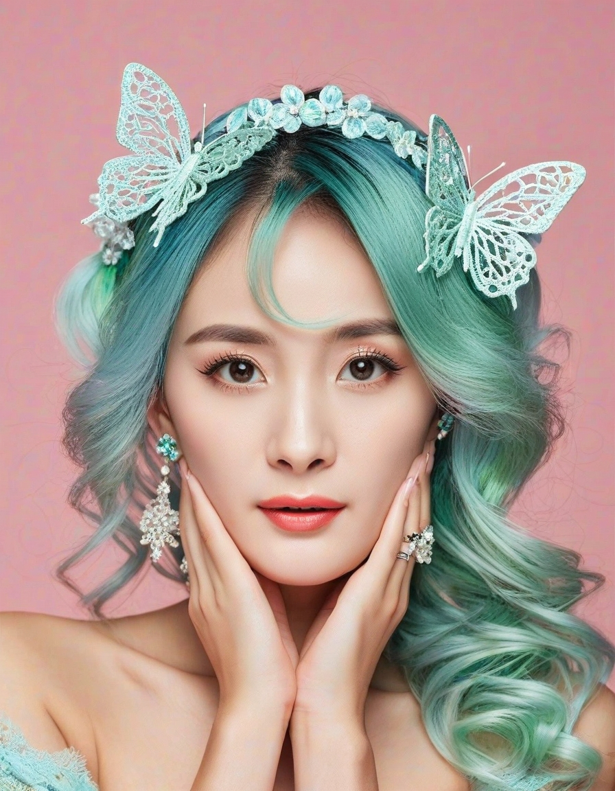 |       
 | 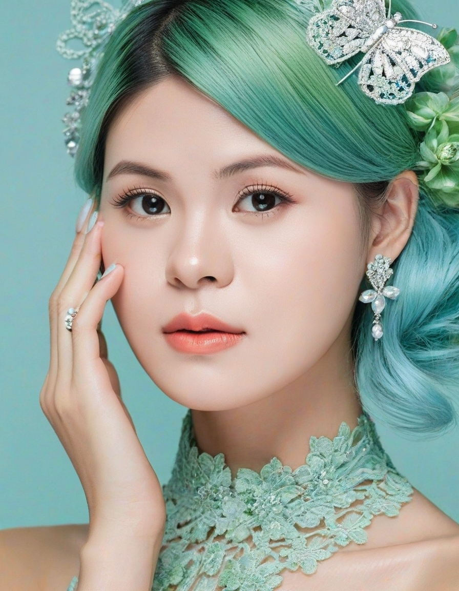    

## Larger Range of Image Scale
While InstantID is unable to achieve this, InstantID-Rome is capable of doing so.

base model: [RealVisXL V4.0](https://civitai.com/models/139562/realvisxl-v40?modelVersionId=344487)
|ID|  Different Image Scale |
|:-------------------------:|:-------------------------:|
 |     

coming ...
